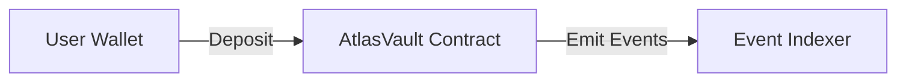
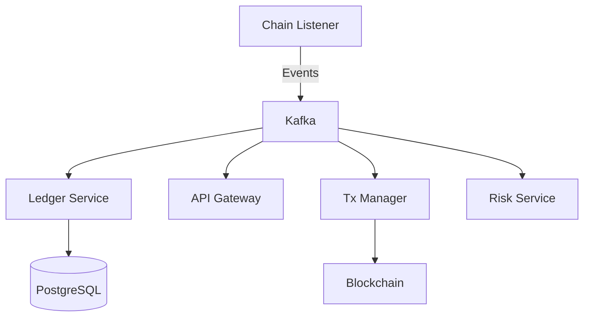

<div align="center">

# 🦁 Recklion Atlas

**Exchange-Grade Blockchain-Fintech Platform**

[](https://ethereum.org)
[](https://go.dev)
[](https://soliditylang.org)
[](https://kafka.apache.org)

---

</div>

## 📖 Descripción

**Recklion Atlas** es un proyecto **exchange-grade** diseñado para demostrar cómo se construye, desde cero, una plataforma fintech moderna integrada con blockchain, combinando:

- 🔗 **Smart contracts** (Solidity + Foundry)
- ⚡ **Backend distribuido** (Go + Kafka)
- 💰 **Contabilidad financiera** (Double-entry ledger)
- 📡 **Event-driven architecture**
- 🔍 **Indexación on-chain** (The Graph + custom indexer)

> **Nota:** El objetivo principal del proyecto **no es crear un exchange comercial**, sino demostrar arquitectura, criterios técnicos y toma de decisiones reales utilizadas por empresas del estilo **Binance**, **Coinbase**, **Kraken** o exchanges institucionales.

---

## 🎯 Objetivo del proyecto

Recklion Atlas busca resolver un problema central en sistemas cripto-financieros:

> **¿Cómo conectar de forma segura, consistente y escalable el mundo on-chain (blockchain) con sistemas off-chain (fintech/backend)?**

### 💡 Solución propuesta

**Mini Exchange + On-Chain Gateway (Non-Custodial Simplified)**

#### Capacidades:

✅ Depósitos on-chain hacia un Vault  
✅ Detección y confirmación de transacciones blockchain  
✅ Registro contable mediante ledger de doble entrada  
✅ Pipeline de retiros con controles de riesgo  
✅ Arquitectura basada en eventos  
✅ Separación clara de responsabilidades entre contratos, backend y front

#### Pilares fundamentales:

- 🔒 **Consistencia financiera**
- 🛡️ **Seguridad**
- 📈 **Escalabilidad**
- 👁️ **Observabilidad**
- ⚙️ **Buenas prácticas de ingeniería**

---

## 🧠 ¿Por qué "Recklion Atlas"?

<table>
<tr>
<td width="50%">

### 🦁 Recklion

**Recklion** es la identidad del autor y la marca bajo la cual se agrupan proyectos de ingeniería orientados a blockchain, fintech e infraestructura.

Representa:

- 🎯 Independencia técnica
- 🏗️ Criterio arquitectónico
- 💪 Sistemas robustos
- 🚫 Alejados del hype

</td>
<td width="50%">

### 🌍 Atlas

**Atlas**, en la mitología, es quien sostiene el mundo.

En ingeniería, el nombre se asocia a:

- 🏛️ Sistemas centrales
- 🔧 Infraestructura crítica
- 🌐 Capas fundamentales

</td>
</tr>
</table>

> **Recklion Atlas** representa el **sistema central** que sostiene la integración entre blockchain y fintech.

---

## 🏗️ Arquitectura general

La arquitectura se divide en dos grandes capas:

### 1️⃣ On-chain (Blockchain)



- 🔗 Smart contracts desplegados en redes **EVM compatibles** (Arbitrum / testnet)
- 🏦 Un **Vault** que custodia fondos y emite eventos confiables
- ⚠️ El contrato **no mantiene balances por usuario**
- 📊 Toda la lógica contable vive **off-chain**

### 2️⃣ Off-chain (Fintech / Backend)



- ⚙️ Servicios backend independientes escritos en **Go**
- 📡 Comunicación mediante **Kafka** (event-driven architecture)
- 💰 **Ledger financiero** con doble entrada en PostgreSQL
- 🔍 **Indexación on-chain** (The Graph + listener propio)
- 🛡️ Control de riesgo, retiros y reconciliación
- 📊 Observabilidad completa (logs, métricas y trazas)

---

## 🔁 Flujos principales

### 📥 Depósitos

```
User → Vault → Listener → Kafka → Ledger → Balance Updated
```

| Paso | Acción                                                 |
| ---- | ------------------------------------------------------ |
| 1️⃣   | El usuario deposita fondos en el **Vault** (on-chain)  |
| 2️⃣   | El **listener** detecta el evento de depósito          |
| 3️⃣   | Se publica un evento interno en **Kafka**              |
| 4️⃣   | El **ledger** registra el movimiento como `PENDING`    |
| 5️⃣   | Tras las confirmaciones necesarias, pasa a `CONFIRMED` |
| 6️⃣   | El balance se refleja en el front desde el **ledger**  |

### 📤 Retiros

```
User Request → Risk Check → Tx Manager → Blockchain → Ledger Settlement
```

| Paso | Acción                                             |
| ---- | -------------------------------------------------- |
| 1️⃣   | El usuario solicita un retiro                      |
| 2️⃣   | El sistema aplica **reglas de riesgo**             |
| 3️⃣   | Se construye y envía la transacción **on-chain**   |
| 4️⃣   | Se confirman los bloques                           |
| 5️⃣   | El **ledger** asienta el movimiento como `SETTLED` |

---

## 🧩 Componentes del sistema

### 📜 Smart Contracts (Solidity + Foundry)

**AtlasVault**

- 🏦 Custodia de fondos
- 📡 Emisión de eventos
- 👥 Roles y pausado
- 🧪 Tests con fuzzing e invariants

### ⚙️ Backend (Go)

<details>
<summary><b>Servicios independientes</b></summary>

| Servicio           | Responsabilidad                           |
| ------------------ | ----------------------------------------- |
| **API Gateway**    | Interfaz con el front                     |
| **Chain Listener** | Escucha eventos on-chain                  |
| **Tx Manager**     | Envío y tracking de transacciones         |
| **Ledger Service** | Contabilidad de doble entrada             |
| **Risk Service**   | Límites, rate limiting y circuit breakers |

</details>

### 📡 Event Bus

**Kafka**

- 🔌 Desacopla servicios
- 🔄 Permite retries e idempotencia
- 📈 Base para la escalabilidad

### 💾 Base de datos

- **PostgreSQL**: Ledger y estado financiero
- **Redis**: Caching, rate limits y locks

### 🔍 Indexación

- **The Graph**: Queries rápidas para UI
- **Indexer propio**: Control total y resiliencia ante fallos externos

### 🎨 Frontend

**Next.js**

- 💼 Conexión de wallet
- 📊 Visualización de balances y actividad
- 🎯 UI mínima y funcional
- 🔧 Herramienta de demo (no foco del proyecto)

---

## 🛠️ Tecnologías utilizadas

<table>
<tr>
<td width="25%">

### ⛓️ Blockchain

- Solidity
- Foundry
- OpenZeppelin
- Arbitrum (L2)

</td>
<td width="25%">

### 🔧 Backend

- Go
- REST + gRPC
- Kafka
- PostgreSQL
- Redis

</td>
<td width="25%">

### 🎨 Frontend

- Next.js
- TypeScript
- Ethers/Viem
- TailwindCSS

</td>
<td width="25%">

### 🐳 Infra

- Docker
- Compose
- OpenTelemetry
- Prometheus

</td>
</tr>
</table>

---

## 📁 Estructura del monorepo

```bash
recklion-atlas/
│
├─ 🌐 apps/
│   └─ atlas-web              # Frontend Next.js
│
├─ 📜 contracts/
│   └─ atlas-vault            # Smart contracts (Solidity)
│
├─ ⚙️  services/
│   ├─ atlas-api              # API Gateway
│   ├─ atlas-ledger           # Ledger Service
│   ├─ atlas-chain-listener   # Event Listener
│   ├─ atlas-tx-manager       # Transaction Manager
│   └─ atlas-risk             # Risk Service
│
├─ 📦 packages/
│   ├─ proto                  # Protobuf definitions
│   └─ shared                 # Shared utilities
│
├─ 🐳 infra/
│   └─ docker-compose.yml     # Local infrastructure
│
└─ 📚 docs/
    └─ architecture.md        # Architecture documentation
```

---

## 👤 Autor

<div align="center">

### Ariel Duarte

**Software Engineer – Blockchain & Fintech**

[](https://linkedin.com/in/arielduarte)
[](https://github.com/reyduar)
[](https://recklion.dev)

</div>

### 🎯 Orientado a roles de:

- 🔗 **Blockchain Engineer**
- 💰 **DeFi / Protocol Engineer**
- ⚙️ **Backend Engineer** (Fintech / Crypto)
- 🏦 **Exchange / Infrastructure Engineer**

---

<div align="center">

**⭐ Si este proyecto te resulta útil, considera darle una estrella**

_Este proyecto forma parte de un proceso de formación avanzada y portfolio técnico_

</div>
